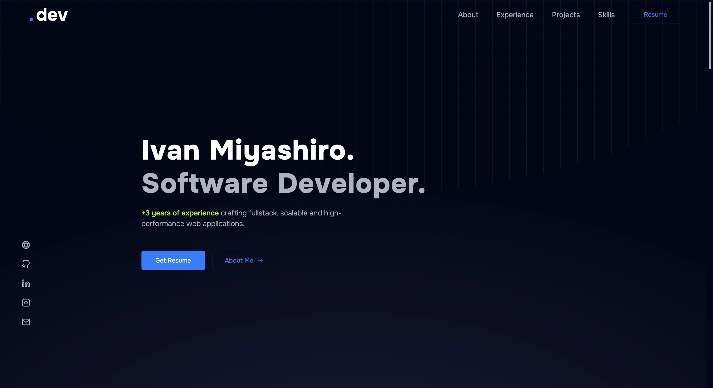

# My Porfolio

My personal portfolio where I talk a little about myself and show my latest projects! It has been crafted with <a href="https://reactjs.org/" target="_blank" >React</a> and <a href="https://astro.build/" target="_blank" >Astro</a>.

## 🧞 Commands

All commands are run from the root of the project, from a terminal:

| Command                   | Action                                           |
| :------------------------ | :----------------------------------------------- |
| `npm install`             | Installs dependencies                            |
| `npm run dev`             | Starts local dev server at `localhost:4321`      |
| `npm run build`           | Build your production site to `./dist/`          |
| `npm run preview`         | Preview your build locally, before deploying     |
| `npm run astro ...`       | Run CLI commands like `astro add`, `astro check` |
| `npm run astro -- --help` | Get help using the Astro CLI                     |

## 🖤 Credits

Some of the websites I got inspiration from...

⭐️ https://brittanychiang.com/
⭐️ http://riccardozanutta.com/
⭐️ https://zonayed.me/
